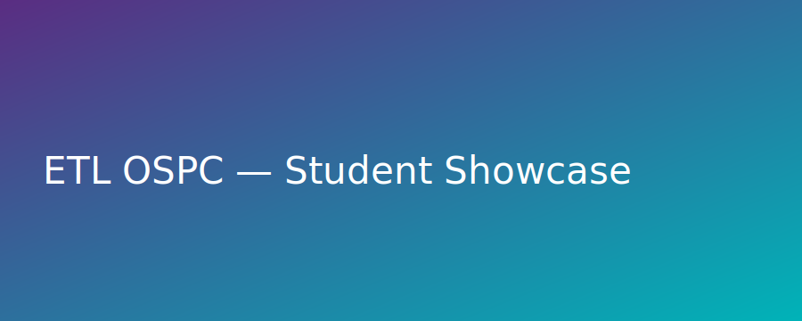

# 🚀 ETL-OSPC Hub — Open Source Portfolio Showcase


---

<p align="center">
  
</p>

**ETL-OSPC Hub (Open Source Project Contributions Hub)** is a student-first, automation-powered portfolio site for the ETL OSPC community.  
It runs 100% on **GitHub Pages** (hosting) and **GitHub Actions** (automation).

> 🌐 Live site (after you push & enable Pages):  
> **https://asmanmalik.github.io/ETL-OSPC-Hub/**

---

## 🌟 Highlights

- 🧑‍💻 **People Directory** — students searchable by name, university, skills  
- 🧠 **Mentors Directory** — curated mentors with badges, expertise & affiliations  
- 🏅 **Hall of Fame** — reads `leaderboard.csv`, publishes monthly awards  
- 🤖 **Automations** — weekly JSON generation & badges, monthly Hall of Fame  
- 🎨 **ETL Brand** — colors, logo, smooth UI with gradient counters

---

## 🏗️ Architecture (How it Works)

```
Contributors / Mentors (Markdown)
        │
        ▼
Python scripts (GitHub Actions)
        │
        ▼
  data/*.json (people, mentors)
        │
        ▼
  docs/*.html + JS (dynamic UI on GitHub Pages)
```

- `/contributors/*.md` → parsed to `data/people.json`
- `/mentors/*.md` → parsed to `data/mentors.json`
- `/data/leaderboard.csv` → SVG badges + Hall of Fame HTML

---

## 📂 Folder Structure

```
ETL-OSPC-Hub/
├─ .github/workflows/      # GitHub Actions (deploy + weekly automations)
├─ assets/
│  ├─ brand/               # ETL logo + banner
│  └─ badges/              # Auto-generated SVG badges
├─ contributors/           # Student markdown profiles
├─ mentors/                # Mentor markdown profiles
├─ data/                   # JSON data + leaderboard.csv
├─ docs/                   # Website (served by GitHub Pages)
│  └─ assets/              # site CSS + JS
├─ scripts/                # Python generators
└─ README.md
```

---

## 🤖 Automations

| Workflow | Schedule | Purpose |
|---|---|---|
| `pages.yml` | on push | Deploys `/docs` to GitHub Pages |
| `generate-people.yml` | weekly | Builds `data/people.json` from `/contributors` |
| `generate-mentors.yml` | weekly | Builds `data/mentors.json` from `/mentors` |
| `generate-badges.yml` | weekly | Creates rank-colored SVG badges |
| `update-hall-of-fame.yml` | monthly | Rebuilds `docs/hall-of-fame.html` |

> Optional secret: set **METRICS_TOKEN** (PAT with `public_repo`, `workflow`) for metrics/badges.

---

## 🧠 Tech Stack

- GitHub Pages (hosting)  
- GitHub Actions (automation)  
- Python 3.x (generators)  
- HTML + CSS + Vanilla JS (UI)  

---

## 🪪 License

MIT © ETL-Online — Empowering students through open-source collaboration.
